# CAMPUSGUARD
## Institutional Continuity Command Center

> *"CampusGuard does not optimize uptime alone. It optimizes institutional continuity when everything cannot be preserved."*

[](https://github.com/sayonikhatua2024-lgtm/CampusGuard-S3/actions/workflows/ci.yml)
[](https://github.com/sayonikhatua2024-lgtm/CampusGuard-S3/releases)
[](https://www.python.org/)
[](https://react.dev/)

---

### Key Documentation Links
- **System Architecture**: [`docs/ARCHITECTURE.md`](docs/ARCHITECTURE.md)
- **3-Minute Demo Script (Judges)**: [`docs/DEMO_SCRIPT.md`](docs/DEMO_SCRIPT.md)
- **Judge FAQ & Defensibility**: [`docs/JUDGE_FAQ.md`](docs/JUDGE_FAQ.md)
- **Public & Local Deployment Guide**: [`docs/PUBLIC_DEMO.md`](docs/PUBLIC_DEMO.md)
- **Release Manifest**: [`RELEASE_MANIFEST.md`](RELEASE_MANIFEST.md)
- **Final Submission Report**: [`FINAL_SUBMISSION_REPORT.md`](FINAL_SUBMISSION_REPORT.md)
- **Post-Hackathon Roadmap**: [`docs/FUTURE_INNOVATIONS.md`](docs/FUTURE_INNOVATIONS.md)

---

## 1. The Problem
Cyber-physical campus infrastructures (academic medical centers, research supercomputing clusters, synchronous online examination halls, residential dormitories) operate under the assumption of 100% resource availability. 

When a physical catastrophe strikes—such as a 30% electrical grid drop, core fiber trunk sever, or chiller plant breakdown—total physical capacity falls below aggregate demand. In this regime, **everything cannot be preserved**.

Standard infrastructure management tools fail blindly: they treat all compute nodes, network packets, and power feeds identically, randomly crashing irreplaceable research simulations and life-safety systems alongside non-essential entertainment Wi-Fi.

---

## 2. Why Traditional AIOps Falls Short
Traditional AIOps platforms ask:
> *"Which server crashed? How do we reboot it to restore 100% uptime?"*

**CampusGuard asks:**
> *"What institutional obligation is at risk? What demand can be safely shed? What must never be sacrificed? What is the mathematically optimal, state-governed recovery path?"*

---

## 3. Signature Thesis: SAME FAILURE ≠ SAME OPTIMAL RESPONSE
Infrastructure state alone does not dictate the optimal recovery response. **Institutional context defines the response.**

```
                                +-----------------------------------+
                                |   Physical Failure: -30% Power    |
                                +-----------------------------------+
                                                  |
                        +-------------------------+-------------------------+
                        |                                                   |
             CONTEXT A: Active Finals                             CONTEXT B: Midnight Break
       +-----------------------------------+               +-----------------------------------+
       | Protect: Online Examination Hall  |               | Protect: Cryogenic Lab Cooling    |
       | Shed:    Research HPC & Wi-Fi     |               | Shed:    Campus Wi-Fi & AV Class  |
       +-----------------------------------+               +-----------------------------------+
                        |                                                   |
       OPTIMAL PLAN: Exam-First Shedding                   OPTIMAL PLAN: Research-First Cooling
```

An identical 30% power loss occurring during synchronous exams demands a completely different load-shedding response than the same event during a holiday research run.

---

## 4. How CampusGuard Solves This

```mermaid
flowchart LR
    SENSE["1. SENSE<br/>Telemetry & Confidence"] --> UNDERSTAND["2. UNDERSTAND<br/>Dependency Cascade"]
    UNDERSTAND --> ASSESS["3. ASSESS<br/>Continuity Contracts"]
    ASSESS --> OPTIMIZE["4. OPTIMIZE<br/>Bounded ICO Search"]
    OPTIMIZE --> GOVERN["5. GOVERN<br/>State-Bound Safety Gate"]
    GOVERN --> ACT["6. ACT<br/>Controlled Execution"]
    ACT --> VERIFY["7. VERIFY<br/>Contract Verification"]
    VERIFY --> AUDIT["8. AUDIT<br/>Decision Provenance"]
```



1. **Continuity Contracts**: Multi-attribute SLA covenants specifying minimum capacity thresholds, penalty weights, and strictly forbidden actions.
2. **Institutional Continuity Optimizer (ICO)**: Deterministic bounded search over a multi-stage degradation ladder, finding the provably least-damaging feasible shedding configuration.
3. **State-Bound Human Governance**: Approvals are cryptographically bound to a specific telemetry fingerprint (`telemetry_hash + context_id + contract_state`). If state drifts before execution, approvals are automatically invalidated.
4. **"Less Evidence → Less Autonomy"**: As observability confidence drops, autonomous intervention scopes are throttled to prevent blind action.
5. **Decoupled Verification Ledger**: Actuator execution success is verified separately from actual contract satisfaction against live post-action telemetry.
6. **Forensic Provenance Tree**: Every event, evaluation, rationale, and state token is permanently recorded for auditability.

---

## 5. Ten-Screen Workflow Gallery

| # | Screen | Operational Role |
| :-: | :--- | :--- |
| **01** | **Command Center** | Live infrastructure capacity, active missions, and cascading dependency tree. |
| **02** | **Continuity Conflict** | Multi-context capacity vs demand envelope comparison (Contexts A, B, C). |
| **03** | **Counterfactual Playground** | Non-mutating forward projection simulation with interactive parameter sliders. |
| **04** | **Recovery Tournament** | Algorithmic competition comparing Do Nothing, Greedy Shedding, and ICO. |
| **05** | **Safety Gate** | State-bound operator authorization with telemetry confidence verification. |
| **06** | **Controlled Execution** | Two-phase simulated execution (Dry Run sandbox -> Live payload dispatch). |
| **07** | **Recovery Verification** | Post-action verification matrix validating predicted vs actual SLA margins. |
| **08** | **Degraded Telemetry** | Sensor fault injection demonstrating "Less Evidence → Less Autonomy". |
| **09** | **Decision Replay** | Chronological forensic provenance tree with full event payload inspection. |
| **10** | **Optimization Benchmark** | Empirical evaluation across 30 standardized deterministic stress scenarios. |

---

## 6. What Is Simulated vs. What Is Real

| Component | Nature | Description |
| :--- | :--- | :--- |
| **Optimization Engine (ICO)** | **REAL** | Python/NumPy deterministic bounded search over degradation permutations with penalty weighting. |
| **Governance & Safety Gate** | **REAL** | Cryptographic state fingerprinting, state-drift invalidation, and role-based sign-off. |
| **Anomaly Detection** | **REAL** | Scikit-learn `IsolationForest` on rolling metric history windows. |
| **Backend REST API** | **REAL** | Python 3.11 + FastAPI + SQLAlchemy 2.0 + APScheduler. |
| **Frontend Application** | **REAL** | React 18 + Vite 5 + Tailwind CSS + Lucide Icons + Recharts. |
| **Audit & Verification** | **REAL** | Decoupled verification ledger comparing predicted vs actual SLA matrices. |
| **Campus Infrastructure Actuators** | **SIMULATED** | Power grid feeds, network switches, and HVAC units are controlled software models designed for safe competition evaluation without physical damage. |

---

## 7. Local Run Instructions

### Prerequisites
- Python 3.11+
- Node.js 20+ & npm

### Backend Setup (Native)
```powershell
# Navigate to backend
cd backend

# Create virtual environment and install dependencies
python -m venv .venv
.\.venv\Scripts\Activate.ps1
pip install -r requirements.txt

# Start backend server
uvicorn app.main:app --host 127.0.0.1 --port 8000 --reload
```
- API Documentation available at: `http://127.0.0.1:8000/docs`
- Health Check: `http://127.0.0.1:8000/api/health`

### Frontend Setup (Native)
```powershell
# Navigate to frontend
cd frontend

# Install dependencies and launch Vite
npm ci
npm run dev
```
- Web Application: `http://localhost:5173/`
- **Default Local Demo Credentials:** `admin` / `admin123`

### Docker Compose (Full Stack)
```powershell
docker compose up --build -d
```

---

## 8. Canonical Public Deployment Architecture

CampusGuard is prepared for split cloud deployment:

- **Frontend:** Public Static Web Service (Vercel / Netlify / Railway) targeting `/frontend` with build command `npm run build`.
- **Backend:** Public API Service (Railway / Render / AWS) targeting `/backend` with start command `uvicorn app.main:app --host 0.0.0.0 --port ${PORT:-8000}`.
- **Database:** Managed MySQL 8.0 instance.
- **Security:** Public deployments require environment-provided `JWT_SECRET_KEY`, `ADMIN_PASSWORD`, and `DATABASE_URL`. Development default credentials must not be used publicly.

*(See [`docs/PUBLIC_DEMO.md`](docs/PUBLIC_DEMO.md) for full deployment configuration).*

---

## 9. Automated Testing & Verification

Run the comprehensive automated test suite (including governance, continuity, optimizer, and resilience benchmarks):
```powershell
$env:PYTHONPATH="backend"
python -m pytest backend/tests/ -v
```

---

## 10. Repository & Release Metadata
- **Release Version**: `v1.0.0-sih2026`
- **Canonical Release Branch**: `stitch-ui-integration-1877636227172226099`
- **Target Main Branch**: `main`
- **Repository**: `sayonikhatua2024-lgtm/CampusGuard-S3`
