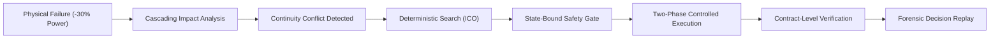

# CAMPUSGUARD
## Institutional Continuity Command Center

> *"CampusGuard does not optimize uptime alone. It optimizes institutional continuity when everything cannot be preserved."*

[](https://github.com/sayonikhatua2024-lgtm/CampusGuard-S3/actions/workflows/ci.yml)
[](https://github.com/sayonikhatua2024-lgtm/CampusGuard-S3/releases)
[](https://www.python.org/)
[](https://react.dev/)

---

### Quick Navigation
- **Architecture**: [`docs/ARCHITECTURE.md`](docs/ARCHITECTURE.md)
- **3-Minute Demo Script**: [`docs/DEMO_SCRIPT.md`](docs/DEMO_SCRIPT.md)
- **Judge FAQ**: [`docs/JUDGE_FAQ.md`](docs/JUDGE_FAQ.md)
- **Public Demo Guide**: [`docs/PUBLIC_DEMO.md`](docs/PUBLIC_DEMO.md)
- **Future Roadmap**: [`docs/FUTURE_INNOVATIONS.md`](docs/FUTURE_INNOVATIONS.md)
- **Release Manifest**: [`RELEASE_MANIFEST.md`](RELEASE_MANIFEST.md)
- **Final Submission Report**: [`FINAL_SUBMISSION_REPORT.md`](FINAL_SUBMISSION_REPORT.md)

---

## 1. The Problem
Modern campus cyber-physical infrastructure (university hospitals, research supercomputers, online examination testing centers, student housing) assumes 100% capacity. When physical grid power fails by 30%, core network trunks collapse, or cooling plants fail under heat stress, standard infrastructure management tools fail blindly—shutting down mission-critical laboratory equipment and synchronous examinations alongside streaming video and dorm Wi-Fi indiscriminately.

---

## 2. Why Traditional AIOps Falls Short
Traditional AIOps asks: *"What server is down? How do we restart it?"*

**CampusGuard asks:** *"What institutional obligation is at risk, what can be safely sacrificed, what must never be sacrificed, and what is the safest feasible recovery?"*

---

## 3. The Solution
CampusGuard is an autonomous, deterministic governor designed specifically for institutional and mission-critical environments. It acts as an intelligent continuity layer that shifts power, computation, and network constraints selectively to protect defined **Institutional Continuity Contracts**.



---

## 4. Core Differentiators

1. **Same Failure ≠ Same Optimal Response**: Infrastructure state alone does not dictate the response. **Institutional Context** defines the response. A 30% power drop during an active exam produces a radically different optimization plan than the exact same failure during an empty campus emergency.
2. **Continuity Contracts**: Multi-attribute SLA bounds with strict priority covenants.
3. **Institutional Continuity Optimizer (ICO)**: Deterministic bounded search guaranteeing mathematical feasibility.
4. **State-Bound Human Governance**: Approvals are cryptographically bound to specific telemetry states; state drift automatically invalidates stale approvals.
5. **"Less Evidence → Less Autonomy"**: Degraded sensor streams automatically restrict automated intervention boundaries.
6. **Explicit Decoupled Verification**: Execution dispatch success is validated separately from actual recovery SLA satisfaction.
7. **Forensic Provenance Tree**: Complete auditability of every decision, telemetry event, and human action.

---

## 5. Ten-Screen Workflow Gallery

| Screen | Workflow Purpose |
| :--- | :--- |
| **01. Command Center** | Real-time infrastructure capacity, active missions, and cascading dependency chain. |
| **02. Continuity Conflict** | Multi-context capacity vs demand envelope comparison (Contexts A, B, C). |
| **03. Counterfactual Playground** | Non-mutating forward projection simulation with interactive parameter sliders. |
| **04. Recovery Tournament** | Multi-strategy competition comparing Greedy, Do-Nothing, and ICO outcomes. |
| **05. Safety Gate** | State-bound operator authorization with telemetry confidence verification. |
| **06. Controlled Execution** | Two-phase simulated execution (Dry Run sandbox -> Live payload dispatch). |
| **07. Recovery Verification** | Post-action verification matrix validating predicted vs actual SLA margins. |
| **08. Degraded Telemetry** | Sensor fault injection demonstrating autonomous scope throttling. |
| **09. Decision Replay** | Chronological forensic provenance tree with full event payload inspection. |
| **10. Optimization Benchmark** | Empirical evaluation across standardized multi-scenario stress tests. |

---

## 6. Technology Stack
- **Backend**: Python 3.11, FastAPI, SQLAlchemy, APScheduler, Scikit-learn (IsolationForest), Pydantic
- **Frontend**: React 18, Tailwind CSS, Vite, Recharts, Lucide-React
- **Database**: MySQL 8.0 (Production) / SQLite In-Memory (Test/Standalone)
- **DevOps**: Docker, Docker Compose, GitHub Actions CI

---

## 7. Local Run Instructions

### Prerequisites
- Node.js 18+ & npm
- Python 3.11+

### Backend Setup
```powershell
# Navigate to backend
cd backend

# Create virtual environment and install dependencies
python -m venv .venv
.\.venv\Scripts\Activate.ps1
pip install -r requirements.txt

# Run backend (using SQLite standalone mode)
$env:DATABASE_URL="sqlite:///./campusguard.db"
uvicorn app.main:app --host 127.0.0.1 --port 8000 --reload
```
API Documentation available at: `http://127.0.0.1:8000/docs`

### Frontend Setup
```powershell
# Navigate to frontend
cd frontend

# Install dependencies and launch Vite dev server
npm install
npm run dev
```
Dashboard available at: `http://localhost:5173/`

**Demo Credentials**: `admin` / `admin123`

---

## 8. Docker Deployment
```powershell
# Build and launch MySQL, Backend, and Frontend containers
docker compose up --build -d
```
*(See [`RELEASE_MANIFEST.md`](RELEASE_MANIFEST.md) for host-specific environment notes).*

---

## 9. Automated Testing
Run the complete automated test suite:
```powershell
$env:PYTHONPATH="backend"
python -m pytest backend/tests/ -v
```

---

## 10. Security & Responsible Use
This repository is a competition prototype utilizing a controlled simulated campus cyber-physical infrastructure model. It is designed for safe evaluation and demonstration of deterministic continuity algorithms and must not be connected to unvalidated physical actuators without appropriate hardware safety bounds.

---

## 11. Post-Submission Roadmap
See [`docs/FUTURE_INNOVATIONS.md`](docs/FUTURE_INNOVATIONS.md) for upcoming architectural developments including:
- Cumulative Continuity Debt Ledger
- Declarative Continuity Constitution / SMT Policy Compiler
- Recovery Equity & Demographic Fairness Governor
- Continuous Resilience Drift Detector
- Continuity Game Days & Synthetic Fault Campaigns
