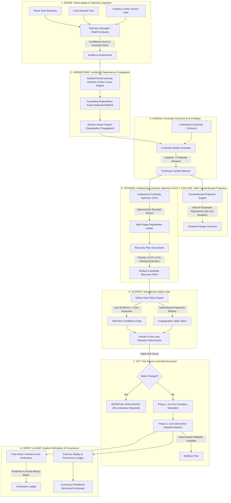

# CampusGuard — System Architecture

---

## 1. Architectural Philosophy

### Uptime vs. Institutional Continuity
Traditional AIOps platforms optimize exclusively for **infrastructure uptime** (e.g. *Which VM crashed? Is ping responding?*). 

In mission-critical, cyber-physical campus environments (academic medical centers, high-performance research clusters, life-safety operations, synchronous examination centers), 100% capacity is not always preservable during severe physical disturbances.

**CampusGuard optimizes institutional continuity:**
- Identifies which institutional obligations are threatened.
- Evaluates what non-critical demand can be safely shed.
- Enforces non-negotiable SLA contracts as strict mathematical boundary constraints.
- Employs deterministic bounded search to construct minimal-collateral-damage recovery strategies.

---

## 2. Core Subsystems

### A. Telemetry & Evidence Confidence
- **Telemetry Manager** calculates an aggregate **Observability Confidence Score** (0–100) across physical power, network, and environmental sensors.
- **"Less Evidence → Less Autonomy" Invariant**: When sensor confidence degrades or goes stale, high-risk automated intervention scopes are blocked.

### B. Mission & Dependency Graph
- **Missions**: Critical organizational workflows (e.g., `life_safety`, `exam_delivery`, `research_hpc`, `student_wifi`).
- **Continuity Contracts**: Define priority levels, minimum capacity thresholds, maximum allowed downtime, and collateral penalty weights.
- **Impact Propagation**: Computes second- and third-order cascading impacts across interconnected systems when root infrastructure fails.

### C. Institutional Continuity Optimizer (ICO)
- Evaluates candidate load-shedding permutations against hard contract bounds.
- Generates a **Degradation Ladder** prioritizing high-elasticity, low-criticality services (e.g., streaming Wi-Fi, background analytics) while protecting zero-tolerance contracts.
- **Recovery Tournament**: Fairly pits ICO against standard heuristics (Greedy capacity shedding, Static priority, Do-nothing) to prove mathematical optimality and SLA preservation.

### D. State-Bound Governance & Safety Gate
- Approvals are cryptographically bound to an exact **State Fingerprint** (`telemetry_hash + context_id + contract_state`).
- **State Drift Detection**: If infrastructure telemetry or institutional context changes between approval and execution, the approval is invalidated.

### E. Two-Phase Execution & Verification
- **Phase 1 (Dry Run)**: Validates safety invariants without altering live state.
- **Phase 2 (Dispatch)**: Applies simulated actuator commands with rollback checkpoints.
- **Verification Engine**: Decoupled from execution; tests actual post-action metrics against predicted outcomes to independently certify SLA recovery.

### F. Forensic Decision Replay & Provenance
- Immutable event stream recording every transition (`FAILURE_DETECTED`, `CONFLICT_ANALYZED`, `PLAN_OPTIMIZED`, `SAFETY_EVALUATED`, `OPERATOR_APPROVED`, `INTERVENTION_EXECUTED`, `CONTRACTS_VERIFIED`).
